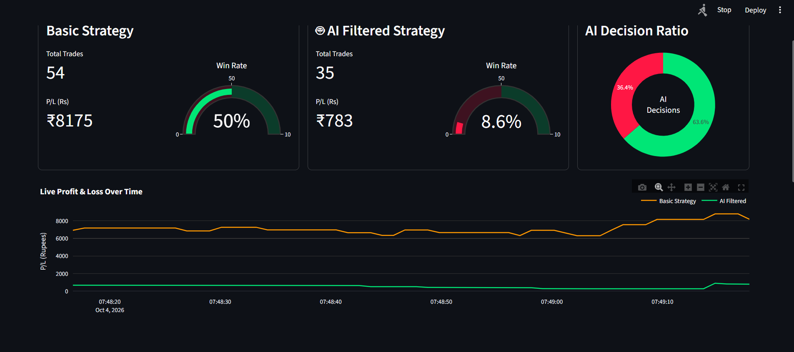

# AI/ML Real-Time Stock Screener (NSE)


**▶ Live demo: https://ai-stock-screener-demo-hwmhgdfx33svxcf78zrsjx.streamlit.app/**

A Python real-time screening and paper-trading system for NSE equities. It detects SMMA20/SMMA120 crossovers, reads Last Traded Quantity (LTQ) dynamics and 5-level Bid/Ask market depth, and passes each signal through a machine-learned **ACCEPT / AVOID** filter. The goal is to catch good trades and, more importantly, to avoid losing ones.



> **Paper trading only.** No real orders are ever placed. Nothing here is investment advice.

## Demo vs. real

The hosted demo runs the **same engine** as the live system (crossover detection, feature engineering, ML filter, paper-trading books) on a **synthetic price feed**, so it works instantly with no broker credentials.

- Prices in the demo are a random walk, so no model can have a real edge there. The demo shows the pipeline mechanics, not trading performance.
- Real results come from live Fyers data collected over multiple trading days (Aug 31 to Sep 14, 2026): 78 real crossovers were combined to train the first properly sized model, with AUC improving from 0.500 to 0.582. That is a small sample and a modest result, reported as it is.

## How it works

1. **Ingest:** live ticks from Fyers (WebSocket + REST historical) or Angel One (SmartAPI), or a mock broker for the demo.
2. **Warm start:** SMMA20/SMMA120 are primed from historical candles, so signals are ready immediately instead of after about two hours of live data.
3. **Detect:** `CrossoverEngine` flags SMMA20/SMMA120 crossovers.
4. **Featurize:** 11 broker-agnostic features (SMMA, LTQ acceleration, 5-level bid/ask imbalance and more), so data from different days and brokers can be combined for training.
5. **Decide:** a `GradientBoostingClassifier` scores each crossover and returns ACCEPT or AVOID with a probability and human-readable reasons.
6. **Paper trade:** two books run side by side from the same feed.
   - **Basic:** enters every crossover.
   - **AI-Filtered:** enters only ACCEPTed signals and exits early when the position monitor flags deterioration.
7. **Persist:** closed trades, every decision (opened, avoided, skipped) and the live dashboard state are saved to a database, so history survives restarts.

Both books use stop-loss, target and max-hold exits.

## Quick start

### Docker (recommended)

You only need Docker. Run from the project folder.

**The demo** (synthetic data, no credentials):

```bash
docker compose --profile demo up --build
```

Open http://localhost:8501.

**The screener plus dashboard** (uses the mock broker by default):

```bash
docker compose --profile live up --build
```

Open http://localhost:8502. History is stored in a Docker volume that survives `docker compose down` (do not use `down -v` unless you want to wipe it).

### Without Docker

```bash
git clone [https://github.com/Anishhgupta/ai-stock-screener-demo.git](https://github.com/Anishhgupta/ai-stock-screener-demo.git)
cd ai-stock-screener-demo
pip install -r requirements.txt
streamlit run demo_app.py
```

To retrain the demo model: `python -m demo.train_demo_model`.

## Live mode (bring your own broker)

Each user runs their own instance with their own broker credentials. There is no shared data feed, which avoids redistributing broker data and regulated-advice territory.

1. Copy `.env.example` to `.env` and fill in your Fyers app credentials (never commit `.env`).
2. Fyers tokens expire daily: run `python fyers_login.py` each trading day and paste the printed token into `.env` as `FYERS_ACCESS_TOKEN`.
3. Real NSE depth rarely reaches the literal 10 lakh bid/ask quantity in the original spec, so set `SCREENER_MIN_DEPTH_QTY` (for example `2000`) before training or running. Otherwise every signal is silently screened out. On Windows CMD: `set SCREENER_MIN_DEPTH_QTY=2000`.
4. Train on saved ticks with `python -m ml.train --tick-csv <path>`.
5. Run the screener and the dashboard in two terminals:

```bash
python main.py --broker fyers
streamlit run dashboard/app.py
```

Pass `--no-db` to `main.py` to run without saving to the database.

A Windows `.exe` can be built with `build_exe.py` (PyInstaller).

## Saved history

Paper trades and decisions go to a local SQLite database (`data/store/screener.db`). Set `SCREENER_DB_URL` to use another database such as Postgres. The dashboard shows live state plus all-time totals, the latest closed trades and the latest decisions, with reasons. Tables: `users`, `paper_positions`, `trade_log`, `live_snapshots`. Every row carries a `user_id`, so moving to multiple users later does not change the data model.

## Testing

```bash
pip install -r requirements.txt
pytest
```

90 automated tests run on every push through GitHub Actions. They cover the SMMA maths, candle aggregation, feature engineering, the depth screen, the crossover pipeline, the paper-trading engine, the storage layer and the dashboard's data logic. Several are regression tests for real bugs listed below, and each was checked by deliberately breaking the code to confirm it fails.

## Bugs found and fixed

Real debugging, documented rather than hidden:

- **Fyers message schema:** Fyers sends `SymbolUpdate` (LTP/LTQ/volume) and `DepthUpdate` (bid/ask levels, no LTP) as separate messages. The adapter now subscribes to both and merges them per symbol.
- **Falsy-zero breakeven bug:** `if p.pnl and p.pnl <= 0` silently dropped exact-breakeven trades (`0.0` is falsy in Python) from both win and loss counts. Now handled with explicit `is not None` checks and a separate breakeven bucket.
- **Mixed clocks in demo trading:** positions were stamped with wall-clock time but compared against an accelerated simulated clock, so every trade looked held for over the max hold time and closed instantly at breakeven. Entry now uses the triggering tick's timestamp.
- **Basic book never traded without a model:** trade logic was gated on model availability. Basic now always trades, with a placeholder AVOID decision when no model is loaded.
- **Blank decision display:** a crossover is a single-tick event, so decision columns were empty on over 99% of ticks. The last real value is now carried forward per symbol, in the demo and in the live dashboard (verified on a real Fyers session).
- **False "OPEN" log entries:** found on a live run. A crossover in a symbol that already had an open position was skipped correctly but logged as opened. Such entries are now logged as `SKIPPED` with the reason.
- **Noisy mock order book:** independently redrawn depth every tick made imbalance flip randomly and tripped the deterioration monitor. Mock depth is now autocorrelated like a real book.
- **Startup race on user creation:** the trading process and the dashboard could both create the default user at once. Caught by a multi-threaded test and fixed with insert-then-handle-conflict.
- **Model portability:** `joblib` models are not guaranteed to load across scikit-learn versions. Retrain locally or pin matching versions (the Docker image pins them).

## Known limitations

- Open positions live in memory. Positions still open when a session ends are discarded, not recorded.
- Carried-forward decisions are not restored after a restart until each symbol's next crossover.
- The Fyers access token must be regenerated every trading day.
- The model is trained on a small sample (78 real crossovers). Treat its results as a proof of pipeline, not a trading edge.
- The Docker setup keeps its own database, separate from a local run's.

## Tech stack

Python 3.12, scikit-learn, joblib, SQLAlchemy, SQLite, Streamlit, Plotly, pandas, fyers-apiv3, Angel One SmartAPI, Docker, pytest, GitHub Actions, PyInstaller.

## Roadmap

Done: CI and regression tests, database persistence, Docker. Next: a FastAPI backend with a background worker per user, authentication with per-user encrypted broker credentials, and deployment to a small server.